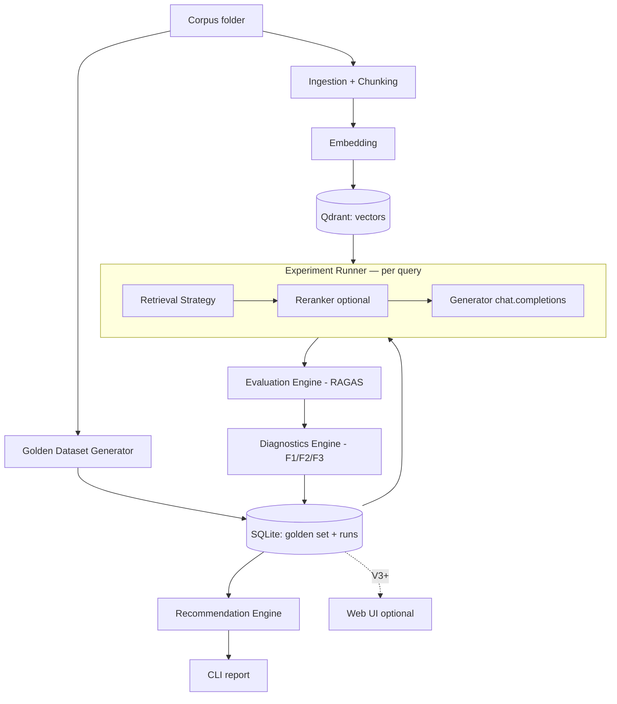

# RetrievalBench — Design & Architecture Document

> A local-first, config-driven harness for running, evaluating, and **diagnosing** retrieval pipelines.
> Primary goal: master retrieval + evaluation by building them; secondary goal: a clean, explainable OSS artifact.

**Status:** Design (pre-implementation)
**Owner:** Kalp
**Last updated:** 2026-06-21

---

## 0. How to read this document

This is a build spec, not a pitch. It is tiered: every section marks features as **[MVP]**, **[V2]**, **[V3]**, or **[Later/Optional]** so you (or an AI coding agent) always know what to build *now* vs *eventually*. If you only read three things, read **§2 (Goals & non-goals)**, **§9 (Build order)**, and **§10 (Risks)** — those control scope and protect you from building the wrong thing.

A recurring **"How I decided"** callout appears under contested choices, because the reasoning is the point — not the conclusion.

---

## 1. Positioning (the honest frame)

**What this is NOT:** a novel product that beats AutoRAG, MLflow, or RAGAS. Those exist and are mature. Auto-testing configs and recommending a pipeline is solved (AutoRAG). Metrics are solved (RAGAS/DeepEval). Auto issue-detection is solved (MLflow). Do not market this as "I solved RAG."

**What this IS:**
1. A **learning vehicle** that forces deep, hands-on retrieval + eval competence — the exact gap your roadmap names as the senior differentiator.
2. A **portfolio artifact**: a typed, async, tested, explainable harness you can defend line-by-line in an interview.
3. A modestly useful OSS tool *if and only if* the one defensible wedge lands well.

**The wedge:** **per-query failure attribution in plain language**, mapped to the three canonical RAG failure modes:
- **F1 — Retrieval miss:** the right chunk was never retrieved.
- **F2 — Generation ignore:** the right chunk was retrieved but the model didn't use it.
- **F3 — Generation error:** the model used the chunk but still answered wrong.

Aggregate scores hide which mode is firing. RetrievalBench's job is to tell you, *per query*, which one happened and why — then aggregate that into a diagnosis. That is the thing most "embed-and-leaderboard" tools do badly, and it's the thing that proves you understand retrieval.

---

## 2. Goals & non-goals

### 2.1 Learning goals (mapped to roadmap)
By shipping the MVP + V2 you will be able to *state, from having built it*:
- When fixed vs recursive vs semantic chunking helps, and why. **[Chunking]**
- Why dense retrieval misses exact-match/keyword queries, and what hybrid (BM25 + dense) fixes. **[Retrieval]**
- What a reranker actually changes and when its latency/cost is worth it. **[Reranking]**
- What each RAGAS metric measures, and which metric moves when you change which component. **[Evaluation]**
- How to build a golden dataset and why its quality caps the validity of every number downstream. **[Eval data]**
- The "learned enough" bar from your roadmap: *being able to say when to use and when NOT to use each technique.*

### 2.2 Product goals
- **G1.** Run a corpus through ≥2 retrieval configs and produce comparable RAGAS scores. **[MVP]**
- **G2.** Attribute every failed query to F1/F2/F3. **[V2 — the wedge]**
- **G3.** Turn aggregate failure patterns into a plain-language diagnosis + recommendation. **[V3]**
- **G4.** Be reproducible: same corpus + same config + same seed → same results. **[MVP, non-negotiable]**

### 2.3 Non-goals (explicit, to kill scope creep)
- **NOT** a hosted multi-tenant SaaS. Local-first, single user.
- **NOT** a training/fine-tuning tool. Inference + eval only.
- **NOT** a general agent framework, MCP server, or chat UI. (Your MCP project is separate.)
- **NOT** trying to support every embedder/store/reranker on day one. One of each, behind an interface.
- **NOT** GraphRAG in the first three phases. Your roadmap explicitly warns against jumping there early; it's a V-Later plugin at most.

---

## 3. System overview

### 3.1 One request, end-to-end, in plain English
*(Per your build-order principle: trace the main path before writing code.)*

> A user points RetrievalBench at a folder of PDFs and a config file. The system **chunks** each document, **embeds** the chunks, and stores them in **Qdrant**. If no golden dataset exists, it **generates** question→expected-context→expected-answer triples from the corpus. The **experiment runner** then, for each query in the golden set: runs the configured **retrieval strategy** to fetch chunks, optionally **reranks** them, feeds the top-k into a **generator** (Chat Completions shape) to produce an answer, and records the retrieved chunks + answer. The **evaluation engine** scores each query with RAGAS (faithfulness, answer relevancy, context precision, context recall). The **diagnostics engine** labels each failed query F1/F2/F3 by comparing what was retrieved vs the expected context vs the answer. Results are persisted to **SQLite**. The user re-runs with a second config; the **recommendation engine** compares the two runs on quality/cost/latency and prints which to use and why.

That paragraph IS the architecture. Everything below is just typing it.

### 3.2 High-level architecture



### 3.3 Build direction
Build **back-to-front along the main path**, exactly as with your LLM wrapper:
1. Retrieval over a tiny hardcoded corpus (prove you can get chunks back).
2. Generator on top (prove end-to-end answer).
3. Evaluation wrapping the answer (prove you get a number).
4. Experiment runner that loops the above over a config.
5. *Then* additive layers: golden generation, reranking, diagnostics, recommendation, UI.

Do not build the UI, the plugin registry, or GraphRAG until the single straight-line path produces a real score.

---

## 4. Data model

Pydantic models are the source of truth (you already use this pattern). Python 3.10+ syntax (`X | None`, built-in generics). These are *domain* models; persistence mapping is in §8.

```python
# src/retrievalbench/models.py

from pydantic import BaseModel, Field
from datetime import datetime
from enum import Enum

class Document(BaseModel):
    id: str
    source_path: str
    title: str | None = None
    text: str
    metadata: dict[str, str] = Field(default_factory=dict)

class Chunk(BaseModel):
    id: str
    document_id: str
    text: str
    index: int                      # order within the document
    token_count: int
    metadata: dict[str, str] = Field(default_factory=dict)

class Corpus(BaseModel):
    id: str
    name: str
    document_ids: list[str]
    created_at: datetime

class GoldenItem(BaseModel):
    id: str
    corpus_id: str
    question: str
    expected_answer: str
    expected_chunk_ids: list[str]   # ground-truth relevant chunks (for F1 detection)

class RetrievalConfig(BaseModel):
    chunking: "ChunkingSpec"
    embedding: "EmbeddingSpec"
    retrieval: "RetrievalSpec"
    reranker: "RerankerSpec | None" = None
    generation: "GenerationSpec"
    top_k_retrieve: int = 20
    top_k_final: int = 5

class RetrievedChunk(BaseModel):
    chunk_id: str
    score: float
    rank: int

class QueryResult(BaseModel):
    golden_item_id: str
    retrieved: list[RetrievedChunk]       # pre-rerank
    reranked: list[RetrievedChunk] | None # post-rerank
    answer: str
    latency_ms: float
    cost_usd: float

class FailureMode(str, Enum):
    NONE = "none"          # passed
    RETRIEVAL_MISS = "f1"  # right chunk never retrieved
    GENERATION_IGNORE = "f2"  # retrieved but ignored
    GENERATION_ERROR = "f3"   # used but wrong

class QueryEvaluation(BaseModel):
    golden_item_id: str
    faithfulness: float | None = None
    answer_relevancy: float | None = None
    context_precision: float | None = None
    context_recall: float | None = None
    failure_mode: FailureMode = FailureMode.NONE
    diagnosis_note: str | None = None     # plain-language, the wedge

class ExperimentRun(BaseModel):
    id: str
    corpus_id: str
    config: RetrievalConfig
    query_results: list[QueryResult]
    evaluations: list[QueryEvaluation]
    aggregate: dict[str, float]           # mean metrics, total cost, p50/p95 latency
    created_at: datetime
```

> **How I decided (data model):** the unit of comparison is the **run** (one config over the whole golden set). `QueryResult` and `QueryEvaluation` are split because *retrieval/generation* and *scoring* are different phases that can be re-run independently — you'll want to re-score without re-retrieving when you change a metric. `expected_chunk_ids` on `GoldenItem` is what makes F1 detectable at all; without ground-truth relevant chunks you can only guess at retrieval misses.

---

## 5. Component design

Each component lists: **responsibility**, **interface**, **MVP scope**, **later scope**, and **what you learn**.

### 5.1 Ingestion + Chunking
**Responsibility:** file → `Document` → `list[Chunk]`.
**Interface (the plugin seam):**
```python
class Chunker(Protocol):
    def chunk(self, doc: Document) -> list[Chunk]: ...
```
- **[MVP]** `FixedSizeChunker(size, overlap)` and `RecursiveChunker` (split on paragraph→sentence→token boundaries). PDF + Markdown + TXT loaders.
- **[V2]** `SemanticChunker` (embed sentences, split on similarity drops).
- **[Later]** `CodeChunker` (function/class-level via tree-sitter), DOCX/GitHub-repo loaders.
**You learn:** why chunk size + overlap dominate retrieval quality; why naive fixed-size cuts answers in half.

> **How I decided (start with 2 chunkers, not 4):** you can't *feel* the effect of semantic chunking until you've measured fixed vs recursive and seen the gap. Build the cheap two first, measure, then add semantic when you have a baseline to beat.

### 5.2 Embedding
**Responsibility:** `list[Chunk]` → vectors.
```python
class Embedder(Protocol):
    name: str
    dim: int
    async def embed(self, texts: list[str]) -> list[list[float]]: ...
```
- **[MVP]** One embedder. **Recommended default:** a local `sentence-transformers` model (e.g. `BAAI/bge-small-en-v1.5`) to keep cost at zero while iterating, OR OpenAI `text-embedding-3-small` if you want zero local setup. Pick one; make it config-swappable.
- **[V2]** Add the other, plus a Qwen/BGE-large option, all behind the same Protocol.
**You learn:** embedding dim/latency/cost tradeoffs; why the *same* retrieval strategy scores differently per embedder.

> **How I decided (local default):** you will run the embedder thousands of times across configs. A paid API turns "iterate freely" into "watch the meter." Local bge-small removes that friction for the learning phase; the Protocol means switching to OpenAI later is a one-line config change.

### 5.3 Vector store
**Responsibility:** persist + query vectors; support dense **and** sparse (for hybrid).
```python
class VectorStore(Protocol):
    async def upsert(self, chunks: list[Chunk], vectors: list[list[float]]) -> None: ...
    async def dense_search(self, query_vec: list[float], k: int) -> list[RetrievedChunk]: ...
    async def sparse_search(self, query: str, k: int) -> list[RetrievedChunk]: ...  # BM25-style
```
- **[MVP]** **Qdrant** (run locally via Docker). Dense search only for the first slice.
- **[V2]** Qdrant native sparse vectors / BM25 for hybrid.
**You learn:** how a vector DB actually indexes and filters; payload/metadata filtering; why "pick one and go deep" beats dabbling in five.

> **How I decided (Qdrant, one store):** your roadmap says pick one vector store and go deep — Qdrant supports both dense and sparse in one engine, so you can do hybrid without a second system. Going deep on one beats shallow knowledge of Pinecone+Weaviate+Chroma for interview credibility.

### 5.4 Retrieval strategies
**Responsibility:** query → ranked `RetrievedChunk`s. This is the heart.
```python
class Retriever(Protocol):
    name: str
    async def retrieve(self, query: str, k: int) -> list[RetrievedChunk]: ...
```
- **[MVP]** `DenseRetriever` (top-k cosine).
- **[V2]** `HybridRetriever` (BM25 + dense, fused via Reciprocal Rank Fusion).
- **[V3]** `QueryRewriteRetriever` (LLM rewrites query first), `MultiQueryRetriever` (generate N queries, union results).
- **[Later/Optional]** `GraphRAGRetriever`. Last, if ever.
**You learn:** the exact-match failure of dense retrieval; RRF; when query expansion helps vs adds noise.

### 5.5 Reranker (optional in the pipeline)
**Responsibility:** re-score retrieved candidates with a cross-encoder, return top-k_final.
```python
class Reranker(Protocol):
    name: str
    async def rerank(self, query: str, candidates: list[Chunk]) -> list[RetrievedChunk]: ...
```
- **[V2]** Default **`BAAI/bge-reranker-v2-m3`** via the **`rerankers`** unified library (Apache-2.0, runs on CPU/consumer GPU, one API across many models).
- **[Later]** Cohere/Jina/Voyage hosted rerankers behind the same Protocol.
**You learn:** bi-encoder vs cross-encoder; the retrieve-50→rerank→top-5 pattern; the latency you pay for the quality lift.

> **How I decided (rerankers library, not raw transformers):** wiring a cross-encoder by hand is a rabbit hole that teaches you tokenizer plumbing, not retrieval. The `rerankers` lib gives one interface over BGE/Cohere/Jina so swapping models is config, not code — which is exactly the comparison you want to *measure*. Read the model card once so you can explain what's under it; don't reimplement it.

### 5.6 Generator
**Responsibility:** (query, top-k chunks) → answer.
```python
class Generator(Protocol):
    async def generate(self, query: str, context: list[Chunk]) -> tuple[str, float]:  # (answer, cost)
        ...
```
- **[MVP]** Chat Completions shape (`chat.completions.create`).
**Synergy:** route this through **your own typed async LLM client wrapper** (the PyPI library you're building). RetrievalBench becomes the first real consumer of it — dogfooding that surfaces bugs to fix and gives the wrapper a credible usage story.
**You learn:** prompt structure for grounded answering; how context ordering affects answers.

### 5.7 Golden dataset generator
**Responsibility:** corpus → `list[GoldenItem]` (question, expected answer, expected chunk ids).
- **[V2]** LLM-based generation: sample chunks, prompt an LLM to produce a question answerable *only* from that chunk + the answer; record the source chunk id as `expected_chunk_ids`. Optionally use RAGAS's test-set generator.
- **[V2]** Human-in-the-loop review step (CLI prompt: keep/edit/drop each item).
**You learn:** why golden-set quality caps everything; how synthetic questions can be too easy/leaky.

> **How I decided (golden set is V2, not MVP):** for the MVP thin slice, hand-write 10–15 golden items yourself. It's faster than building a generator, and hand-writing them teaches you what a *good* eval question is — which you need before you can judge generated ones. Automate only once you know what "good" looks like.

### 5.8 Experiment runner
**Responsibility:** orchestrate the per-query loop for one config over the golden set; produce an `ExperimentRun`.
- **[MVP]** Sequential loop, one config.
- **[V2]** Run N configs from a config file; cache embeddings/index per (chunking, embedder) so you don't re-embed for every retrieval variant.
- **[V3]** Async concurrency with a bounded semaphore for the I/O-bound LLM/embedding calls.
**You learn:** experiment hygiene — seeds, caching, reproducibility, cost accounting.

> **How I decided (caching matters early):** the combinatorial blowup is real — 4 chunkers × 3 embedders × 4 retrievers × 2 rerankers = 96 configs. Re-embedding per config is the difference between a 5-minute and a 5-hour run. Key the vector index on `(chunking_spec, embedding_spec)` and reuse it across retrieval/rerank variants.

### 5.9 Evaluation engine
**Responsibility:** `QueryResult` → `QueryEvaluation` (the four RAGAS metrics).
- **[MVP]** RAGAS: **faithfulness, answer relevancy, context precision, context recall**.
- **[V3]** DeepEval for CI-style pass/fail assertions (hallucination, completeness).
**Critical config:** the **judge LLM must be a different model family** than the generator — same-family judges are too lenient. Make judge model a separate config field.
**You learn:** what each metric actually measures; the difference between retrieval metrics (precision/recall) and generation metrics (faithfulness/relevancy).

### 5.10 Diagnostics engine — **the wedge**
**Responsibility:** label each query F1/F2/F3 and write a plain-language note.
**Logic (deterministic rules over the metrics + ground truth):**
- **F1 Retrieval miss:** none of `expected_chunk_ids` appear in `retrieved` → "The relevant chunk was never retrieved. Likely cause: {dense-only on a keyword query / chunk too small / overlap too low}."
- **F2 Generation ignore:** expected chunk *was* retrieved (high context recall) but faithfulness/answer correctness low → "Relevant context was retrieved but the answer didn't use it. Likely cause: context buried below top position / prompt not grounding."
- **F3 Generation error:** context retrieved and faithfulness high but answer still wrong vs expected → "Model used the context but answered incorrectly. Likely cause: reasoning/synthesis, not retrieval."
- **Aggregation:** count failure modes across the run → "62% of failures are F1 (retrieval misses), concentrated in keyword-style queries → switch dense → hybrid."
**You learn:** this is where you internalize *how to debug a RAG system*, which is the senior skill.

> **How I decided (rules, not an LLM judge, for F1/F2/F3):** the failure mode is *derivable* from data you already have (did the expected chunk get retrieved? is faithfulness high?). A rules engine is deterministic, free, explainable, and teaches you the causal model. Use the LLM only for the human-readable note, not the classification.

### 5.11 Recommendation engine
**Responsibility:** compare runs → recommend a config with justification across quality/cost/latency.
- **[V3]** Pareto-style: pick the config with best faithfulness within a cost/latency budget; explicitly call out diminishing returns (e.g. "GraphRAG adds 0.5% for 3× cost — not worth it").
**You learn:** product thinking — "which RAG to build," not "how to build RAG."

### 5.12 Interfaces: CLI and (optional) UI
- **[MVP]** **CLI** (Typer): `rbench ingest`, `rbench gen-golden`, `rbench run --config x.yaml`, `rbench compare run_a run_b`, `rbench report run_id`.
- **[V3/Optional]** Web UI (FastAPI + a light frontend) with: leaderboard, experiment comparison, **chunk viewer** (see how a doc was split + overlap), **retrieval viewer** (query → retrieved vs reranked chunks side by side), diagnosis screen.
**You learn:** CLI-first keeps you honest; the viewers are where RAG becomes *visible* and are the most demo-able part.

> **How I decided (CLI before UI):** a UI is a tempting time sink that produces zero retrieval learning. Everything must work and be reproducible from the CLI first. The UI is a presentation layer over data the CLI already produces — build it only once the engine is solid, and only the chunk/retrieval viewers (the genuinely illuminating screens).

### 5.13 Observability & CI **[Later/Optional]**
- **Langfuse** for token/cost/latency tracing once you want production-style telemetry.
- **CI eval gate:** GitHub Action runs the golden set on every PR, fails if a key metric regresses vs baseline. This is the "eval-first" reliability signal that's genuinely differentiating on a resume — worth doing *for your own repo* even at small scale.

---

## 6. Folder / package structure

Applying your rules: `src/` layout (publishable, forces tests to import the installed package); **a folder only when ≥2 files belong together**; flat files otherwise.

```
retrievalbench/
├── src/
│   └── retrievalbench/
│       ├── __init__.py
│       ├── models.py            # all Pydantic domain models (one file until it hurts)
│       ├── config.py            # config loading/validation (YAML -> RetrievalConfig)
│       ├── cli.py               # Typer entrypoint
│       ├── runner.py            # experiment runner / orchestration
│       ├── recommend.py         # recommendation engine
│       ├── ingest/              # FOLDER: loaders + chunkers (≥2 files)
│       │   ├── __init__.py
│       │   ├── loaders.py
│       │   └── chunkers.py
│       ├── retrieval/           # FOLDER: embedders, store, retrievers, rerankers
│       │   ├── __init__.py
│       │   ├── embedders.py
│       │   ├── store.py
│       │   ├── retrievers.py
│       │   └── rerankers.py
│       ├── generate.py          # generator (single file; wraps your LLM client)
│       ├── golden.py            # golden dataset generation
│       ├── eval/                # FOLDER: ragas wrapper + diagnostics (≥2 files)
│       │   ├── __init__.py
│       │   ├── metrics.py       # RAGAS integration
│       │   └── diagnostics.py   # F1/F2/F3 rules engine — the wedge
│       └── storage.py           # SQLite persistence
├── tests/
├── configs/                     # example experiment YAMLs
│   ├── baseline_dense.yaml
│   └── hybrid_reranked.yaml
├── pyproject.toml
└── README.md
```

> **How I decided (folders):** `ingest/`, `retrieval/`, and `eval/` each hold ≥2 cohesive files, so they're folders. `generate.py`, `golden.py`, `storage.py`, `recommend.py` are single files — making them folders now would be premature. Split a file into a folder *when it grows a second file*, not before.

---

## 7. Configuration (the experiment unit)

Experiments are declared in YAML so a run is fully reproducible from a file. Example:

```yaml
# configs/hybrid_reranked.yaml
name: hybrid_reranked
chunking: { type: recursive, size: 800, overlap: 150 }
embedding: { model: bge-small-en-v1.5, provider: local }
retrieval: { type: hybrid, fusion: rrf }
reranker: { model: bge-reranker-v2-m3 }
generation: { model: gpt-4o-mini, provider: openai }
evaluation: { judge_model: claude-haiku, metrics: [faithfulness, answer_relevancy, context_precision, context_recall] }
top_k_retrieve: 50
top_k_final: 5
seed: 42
```

Config → validated into `RetrievalConfig` (Pydantic) → drives the runner. Note `judge_model` differs from `generation.model` (different family) by design.

---

## 8. Storage & persistence

- **Vectors:** Qdrant (Docker, local). Collection per `(corpus, chunking, embedding)`.
- **Everything else** (corpora, golden sets, runs, results, evaluations): **SQLite**. Local, zero-setup, longitudinal — you can query "how did faithfulness change across my last 10 runs."
- Pydantic models serialize to/from rows via a thin `storage.py`. No ORM in the MVP — `sqlite3` + `model_dump_json()` into a JSON column for nested objects is enough; introduce SQLModel only if querying gets painful.

> **How I decided (SQLite + JSON columns, no ORM):** the access pattern is "write a run, read runs back for comparison" — not complex relational queries. A heavyweight ORM is ceremony you don't need yet. Start with `sqlite3` and JSON columns; graduate to SQLModel only when you actually need typed queries across nested fields.

---

## 9. Build order & phasing

Each phase has a **Definition of Done (DoD)** and a **learning checkpoint** (the roadmap "you've learned enough when you can state X" bar). Effort estimates assume a focused student; treat them as relative, not promises.

### Phase 0 — Thin slice (the spike) · ~3–5 days **[MVP core]**
Goal: one straight line from documents to a score. Hardcode aggressively.
- Load 3–5 PDFs → `FixedSizeChunker` → local embedder → Qdrant (dense only).
- `DenseRetriever` → `Generator` (your LLM wrapper) → answer.
- **10–15 hand-written golden items.**
- RAGAS on the answers → print mean metrics.
- **DoD:** `rbench run --config baseline_dense.yaml` prints 4 numbers.
- **Checkpoint:** you can explain what each RAGAS metric measured on a real example.

### Phase 1 — Real MVP · ~1 week **[MVP]**
- Add `RecursiveChunker`; make chunker/embedder/retriever swappable via config.
- Experiment runner loops over a config; results persisted to SQLite.
- `rbench compare`: two runs side by side.
- Reproducibility (seeds, cached index).
- **DoD:** compare fixed-512 vs recursive-800 and read the metric delta from storage.
- **Checkpoint:** you can state when fixed vs recursive chunking wins, from your own data.

### Phase 2 — The wedge · ~1.5 weeks **[V2]**
- `HybridRetriever` (BM25 + dense, RRF) using Qdrant sparse.
- `Reranker` (bge-reranker-v2-m3 via `rerankers`).
- **Diagnostics engine: F1/F2/F3 labeling + plain-language notes.**
- LLM golden-set generator with human review.
- **DoD:** a run report that says "62% of failures are F1, concentrated in keyword queries → try hybrid," and switching to hybrid measurably reduces F1.
- **Checkpoint:** you can debug a RAG system by failure mode, not vibes.

### Phase 3 — Polish + product thinking · ~1.5 weeks **[V3]**
- Recommendation engine (Pareto over quality/cost/latency).
- Query-rewrite + multi-query retrievers.
- DeepEval CI gate on your own repo.
- Optional: chunk viewer + retrieval viewer UI (the two demo-able screens).
- **DoD:** `rbench recommend` outputs a justified pipeline choice with cost/latency tradeoffs.
- **Checkpoint:** you can answer "which RAG should I build for this corpus and why."

### Phase Later — Optional, only if motivated
- Semantic + code chunking, more embedders/rerankers, Langfuse, GraphRAG plugin, hosted demo, PyPI release.

**Pace guidance:** Phases 0–2 are the high-learning-density core and the part worth finishing even if you stop there. Phase 0 + 1 + 2 ≈ the "Retrieval + Evaluation" slice of your roadmap. Don't let Phase 3 polish delay starting the next roadmap topic.

---

## 10. Risks & honesty notes

1. **Golden-set quality is the ceiling.** Every score is only as valid as your golden set. Garbage-in → meaningless leaderboards. Hand-write the first set; review generated ones. This is the single biggest validity risk.
2. **LLM-judge bias.** A judge from the same family as the generator scores too leniently. Always set `judge_model` to a different family. Mention this in your README — it signals you understand eval pitfalls.
3. **Cost/latency blowup.** The config grid is combinatorial. Cache the index per (chunking, embedding); start with a local embedder; cap the golden set size while iterating.
4. **Scope creep is the project-killer.** The 12-component vision is a trap. Finishing Phases 0–2 cleanly beats a half-built 12-component skeleton, for both learning and portfolio.
5. **Saturation (be honest in your writeup).** AutoRAG/MLflow/RAGAS exist. Frame your README as "a from-scratch retrieval-eval harness built to deeply understand and *diagnose* retrieval," not "a new tool that beats X." Authenticity reads better to the startups you're targeting than overclaiming.
6. **Semantic chunking is fiddly.** It rarely beats good recursive chunking enough to justify its complexity early. Deprioritize.

---

## 11. Open questions for you to decide

These are genuine forks; each has a default + the tradeoff so you can decide with reasoning:
- **Embedder default:** local bge-small (zero cost, some setup) vs OpenAI (zero setup, metered). *Default: local, for free iteration.*
- **Judge model:** which family? *Default: a cheap model from a different family than your generator.*
- **UI or CLI-only?** *Default: CLI-only through Phase 2; add only the two viewer screens in Phase 3 if you want a demo.*
- **PyPI release?** *Default: release only after Phase 2, and only if the diagnostics output is genuinely clean — don't publish a thin RAGAS wrapper.*
- **How big is the golden set?** *Default: 15 hand-written for MVP, ~50 generated+reviewed by Phase 2.*

---

## 12. One-paragraph summary for an AI coding agent

> Build a local-first Python package (`src/` layout, Pydantic models, async I/O, Typer CLI) that ingests documents, chunks/embeds them into Qdrant, runs configurable retrieval pipelines (dense → hybrid → reranked) over a golden Q&A set, generates answers via a Chat-Completions generator, scores them with RAGAS, and — the differentiator — classifies every failed query as F1 (retrieval miss) / F2 (generation ignore) / F3 (generation error) via a deterministic rules engine, then recommends a config across quality/cost/latency. Build back-to-front along the main path; ship Phase 0 (hardcoded straight line to a score) before adding any plugin abstraction, golden generation, or UI.
